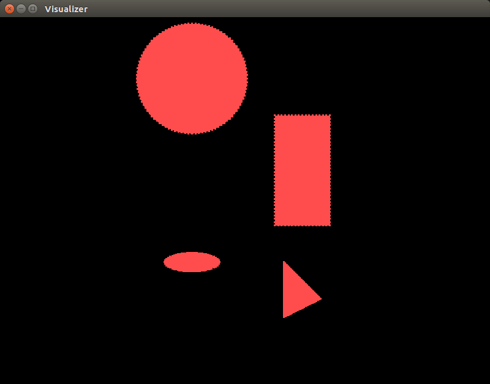
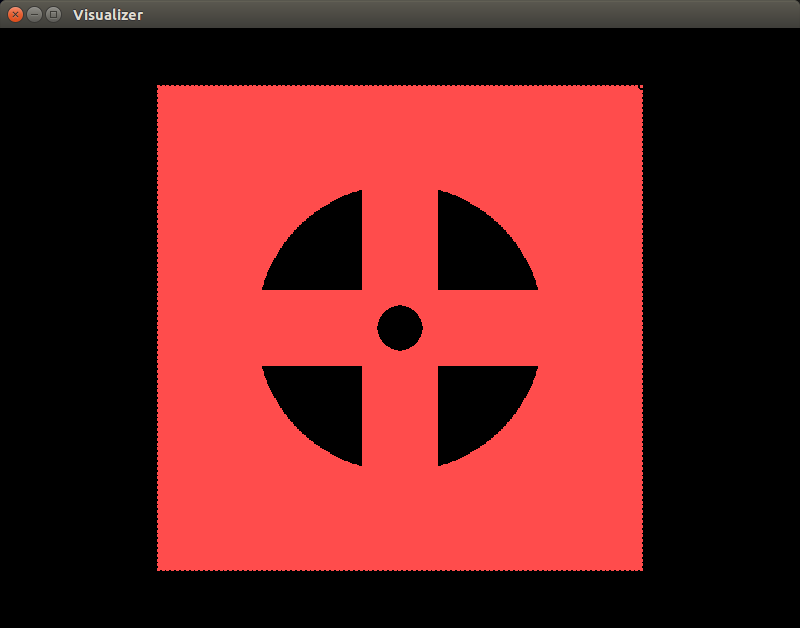
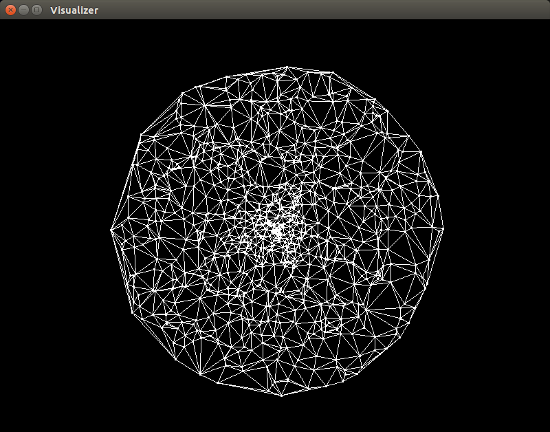

# CompGeometry
Computational Geometry classes
* Basic objects (Point, Line, Box, LineSegment, Plane)
* Basic predicates (in_circle(), in_sphere(), circumcircle(), circumsphere(), orientation2D/3D())
* 2D and 3D primitive geometries (Circle, Sphere, Ellipsoid, Extrusion, etc...)
* Constructive Solid Geometry (2D and 3D)
* Spatial data classes (kd-tree, quad/octree)
* Point data manipulation (PointCloud, filtering, sorting, convex hull)
* Delaunay triangulation, isosurface generation
* STL format support

